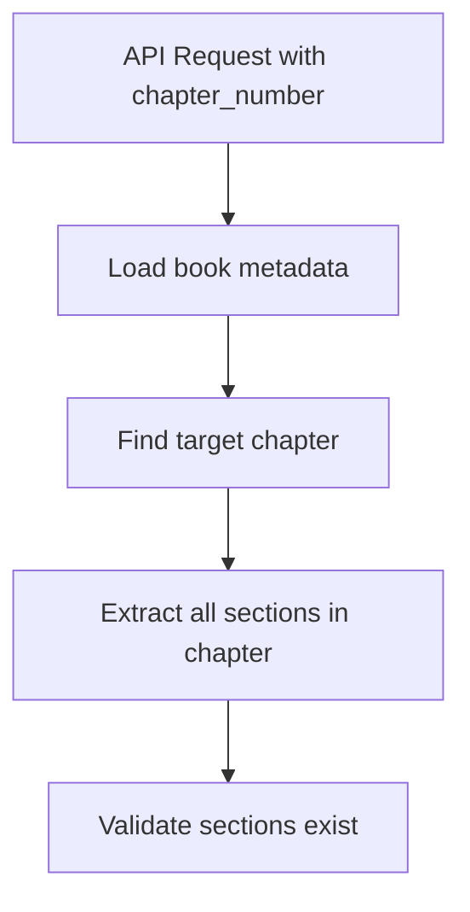
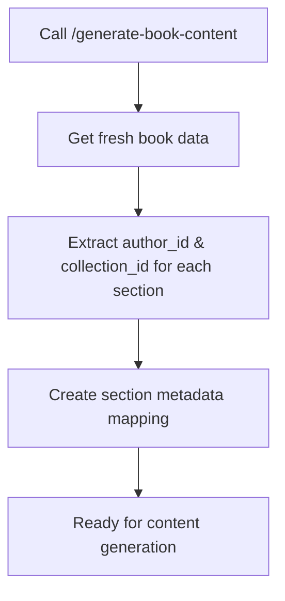
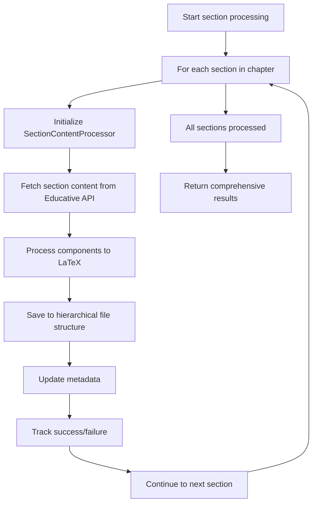

# Enhanced /generate-section-content API Documentation

## Overview

The `/generate-section-content` endpoint has been completely redesigned to automatically generate all sections for a given chapter, eliminating the need for users to manually specify individual section IDs, author IDs, or collection IDs.

## Key Enhancements

### 🔧 **Simplified Request Structure**
- **Before**: Required `section_id`, `author_id`, `collection_id` for each section
- **After**: Only requires `chapter_number` - everything else is automatically discovered

### 🚀 **Batch Processing**
- **Before**: Generated one section at a time
- **After**: Generates all sections in a chapter in a single API call

### 🎯 **Intelligent Data Discovery**
- Automatically extracts `author_id`, `collection_id`, and `section_id` from `/generate-book-content` data
- Smart mapping of section metadata to ensure accurate API calls
- Fallback mechanisms for missing data

## API Specification

### Request Model
```json
{
  "book_name": "string",           // Required: Name of the generated book
  "chapter_number": 1,             // Required: Chapter number (1-based)
  "educative_course_name": "string", // Required: Course name for API calls
  "token": "string",               // Optional: Authentication token
  "cookie": "string",              // Optional: Authentication cookie
  "use_env_credentials": true      // Optional: Use environment credentials
}
```

### Response Model
```json
{
  "success": true,
  "generated_sections": [
    {
      "section_id": "4771234193080320",
      "section_title": "Getting Ready for the System Design Interview",
      "section_file_path": "files/chapter_1_introduction/section_4771234193080320.tex",
      "author_id": "10370001",
      "collection_id": "4941429335392256",
      "generated_images": ["Images/chapter_1/section_4771234193080320/image1.png"],
      "component_types": ["text", "list", "image"],
      "latex_content_length": 2045
    }
  ],
  "total_sections_generated": 5,
  "failed_sections": [
    {
      "section_id": "1234567890",
      "section_title": "Failed Section",
      "section_index": 3,
      "error": "API timeout"
    }
  ],
  "chapter_info": {
    "chapter_number": 1,
    "chapter_title": "Introduction to System Design",
    "chapter_slug": "introduction-to-system-design",
    "total_sections": 6,
    "successful_sections": 5,
    "failed_sections": 1
  },
  "error_message": null,
  "source": "chapter_1_batch_generation"
}
```

## Workflow

### 1. **Chapter Discovery**


### 2. **Metadata Extraction**


### 3. **Batch Generation**


## Error Handling

### **Partial Success Support**
- The API continues processing even if some sections fail
- Detailed error reporting for each failed section
- Success is determined by at least one section being generated successfully

### **Robust Fallback Mechanisms**
- Default author_id and collection_id if section-specific data is missing
- Graceful handling of API timeouts and network errors
- Comprehensive error messages with context

## File Organization

### **Hierarchical Structure**
```
generated_books/
└── {book_name}/
    └── files/
        └── chapter_{number}_{slug}/
            ├── section_{id1}.tex
            ├── section_{id2}.tex
            └── section_{id3}.tex
```

### **Metadata Updates**
- Each generated section updates the metadata with:
  - `content_status: "generated"`
  - `generated_timestamp: ISO timestamp`
  - `component_types: [array of component types]`

## Usage Examples

### **Basic Chapter Generation**
```bash
curl -X POST "http://localhost:8000/generate-section-content" \
  -H "Content-Type: application/json" \
  -d '{
    "book_name": "system_design_handbook",
    "chapter_number": 1,
    "educative_course_name": "grokking-system-design-interview",
    "use_env_credentials": true
  }'
```

### **With Custom Credentials**
```bash
curl -X POST "http://localhost:8000/generate-section-content" \
  -H "Content-Type: application/json" \
  -d '{
    "book_name": "system_design_handbook", 
    "chapter_number": 2,
    "educative_course_name": "grokking-system-design-interview",
    "token": "your_token_here",
    "cookie": "your_cookie_here",
    "use_env_credentials": false
  }'
```

## Performance Considerations

### **Timeout Management**
- Individual section processing has built-in timeouts
- Overall API call may take several minutes for chapters with many sections
- Consider using a 5-10 minute timeout on the client side

### **Memory Efficiency**
- Sections are processed sequentially to manage memory usage
- LaTeX content is written to disk immediately after generation
- Metadata is saved incrementally to prevent data loss

## Integration with Existing Workflows

### **Prerequisites**
1. Book structure must be created via `/generate-latex-book`
2. Valid authentication credentials (token/cookie or environment variables)
3. Sufficient disk space for generated content and images

### **Backward Compatibility**
- The old single-section approach is no longer supported
- Migration path: Use the new chapter-based approach instead
- All existing file structures and naming conventions are preserved

## Monitoring and Debugging

### **Progress Tracking**
- Console output shows real-time progress: `"Processing section 3/8: Section Title"`
- Success/failure status for each section
- Detailed error messages for troubleshooting

### **Response Analysis**
- `total_sections_generated`: Quick success metric
- `failed_sections`: Detailed failure analysis
- `chapter_info`: Comprehensive chapter statistics

---

**Status**: ✅ **IMPLEMENTED AND READY**
**Version**: Enhanced as of July 31, 2025
**Breaking Changes**: Yes - completely new request/response structure
**Migration Required**: Update all calls to use chapter-based approach
